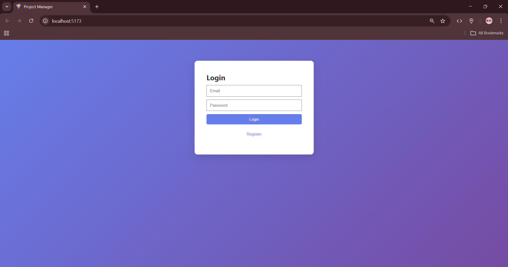
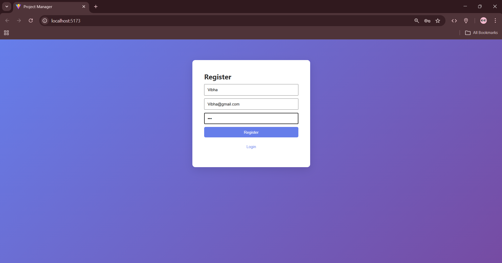
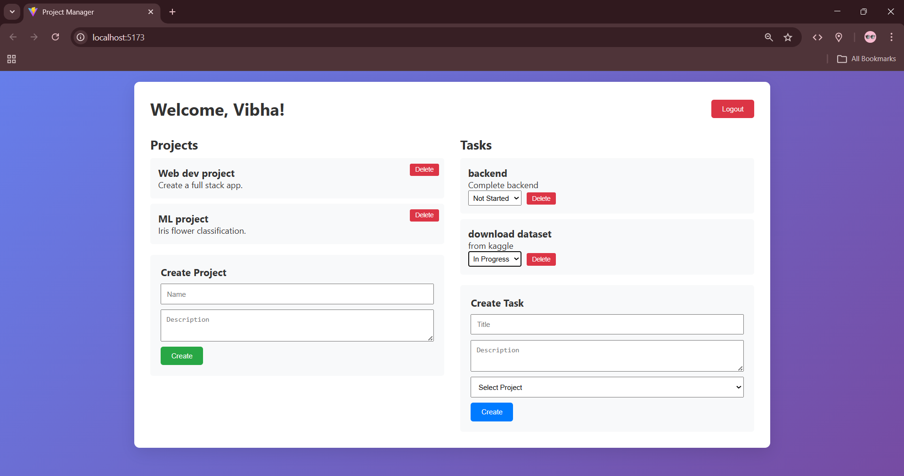

# Project Manager #
A full-stack web application for managing projects and tasks, built with a React frontend and Node.js/Express backend.
## Features ##
* User authentication (register, login, logout)
* Project creation and management
* Task assignment and tracking
* Dashboard for overview
* Responsive UI
## Preview ##

## Tech Stack ##
**Frontend**
* React 19
* Vite (for development and build)
* React Router DOM (for routing)
* ESLint (for code linting)
**Backend**
* Node.js with Express
* MongoDB with Mongoose (for database)
* JWT for authentication
* bcryptjs for password hashing
* CORS for cross-origin requests
## Installation ##
1. Clone the repository:    
   `git clone <your-repo-url>`   
   `cd project_manager`

2. Install backend dependencies:  
   `cd backend`  
   `npm install`

4. Install frontend dependencies:  
   `cd ../frontend`  
   `npm install`

5. Set up environment variables:  
   Create a .env file in the backend directory with:  
   PORT=3000  
   MONGO_URI=<your-mongodb-connection-string>  
   JWT_SECRET=<your-jwt-secret> 
## Usage ##
**Start the backend server:**  
`cd backend`  
`npm run dev`  
(Runs on [http://localhost:3000](http://localhost:3000))

**Start the frontend:**  
`cd frontend` 
`npm run dev` 
(Runs on http://localhost:5173)

Open your browser to http://localhost:5173 and register/login to use the app.
## API Endpoints ##
**Authentication**
* `POST /api/auth/register` - Register a new user
* `POST /api/auth/login` - Login user
* `POST /api/auth/logout` - Logout user

**Projects**
* `GET /api/projects` - Get all projects (authenticated)
* `POST /api/projects` - Create a new project
* `PUT /api/projects/:id` - Update a project
* `DELETE /api/projects/:id` - Delete a project

**Tasks**
* `GET /api/tasks` - Get all tasks
* `POST /api/tasks` - Create a new task
* `PUT /api/tasks/:id` - Update a task
* `DELETE /api/tasks/:id` - Delete a task
